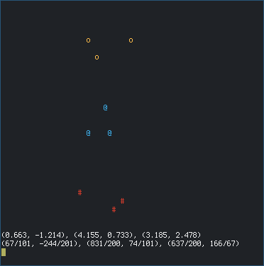

# grimrec

Record the focused window to a GIF file, using [grim](https://github.com/emersion/grim) and [ImageMagick](https://www.imagemagick.org/), under [Sway](https://github.com/swaywm/sway).

This is the "glue and rubberband" way of doing a screeen recording under Sway, but it works.

The code is just 122 lines of Python.

## Example recording

## Installation

    install -Dm755 grimrec /usr/bin/grimrec

* Install by using `sudo` or running as `root`, if needed.
* If possible, install with a proper package manager.
* Install to `/usr/local/bin` if you have a UNIX beard.

## Configuration

Add this to `~/.config/sway/config`:

    bindsym Ctrl+Shift+F12 exec /usr/bin/grimrec /tmp/output.gif 20 9

This will set up `ctrl-shift-f12` as a hotkey to record the currently focused window for 20 seconds, with 9 frames per second, to `/tmp/output.gif`.

Then reload the configuration in Sway, or restart Sway.

The conversion to GIF may take a couple of seconds after the recording has completed.

If you have `mako` and `notify-send` installed, a message can be displayed after the file has been written:

    bindsym Ctrl+Shift+F12 exec /usr/bin/grimrec /tmp/output.gif 20 9 && notify-send 'Recording completed'

## Features and limitations

* The FPS is limited by how fast screenshots can be taken of the focused window.
* 24 frames per second is usually not possible, but it depends on the size of the window and the speed of the computer.
* The conversion from screenshots to GIF will take a very long time if the focused window is large. Try to keep it as small as possible.
* Make sure there is enough space in `/tmp` for what you are trying to capture.

## Dependencies

These executables are expected to be found:

* `/usr/bin/convert`
* `/usr/bin/env`
* `/usr/bin/grep`
* `/usr/bin/grim`
* `/usr/bin/swaymsg`
* Python 3 in the `PATH` as `python3`

## Testing

For testing `grimrec`, before installing, try creating a 1 second recording, with 7 frames per second:

    ./grimrec a.gif 1 7

It can be viewed with `imv`:

    imv a.gif

## General info

* Version: 1.0.0
* License: BSD-3
* Author: Alexander F. Rødseth &lt;xyproto@archlinux.org&gt;
